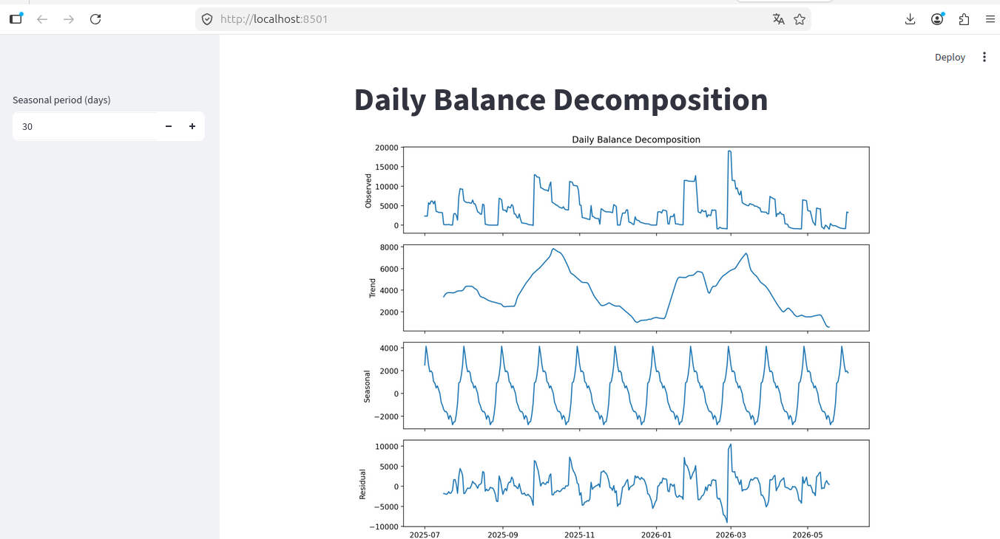
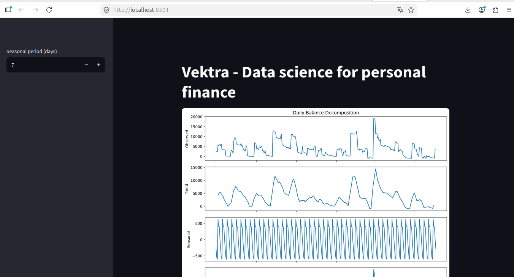
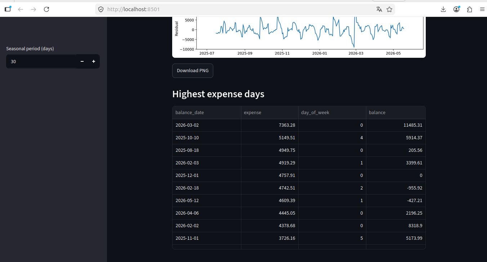

# Vektra POC

Project that aims to be a Proof of Concept of the use of spec driven development and claude code to analyze personal finance.

## Instalation

### Python packages

```
python3 -m venv venv
source venv/bin/activate
pip install -r requirements
```

### Postgres

```
docker run --name my-postgres -e POSTGRES_USER=<user> -e POSTGRES_PASSWORD=<user> -e POSTGRES_DB=mydatabase -p 5432:5432 -v pgdata:/var/lib/postgresql/data -d postgres
```

### Environment configuration variables

Copy file .env.example to .env inside the config directory, and configure the DATABASE_URL and DATA_ROOT variables.

## Usage

### Load transactions

```
python3 -m src.cli <path-of-ofx-files> <account-label>
```

### Daily balance

```
python -m src.balance <initial-balance>
```

## Prompts used to create the project

### Constitution

```
/speckit-constitution create principles for a data science project. There will be features for etl, data analysis and time-series analysis. The data folder is decoupled from the
  project folder. Keep the project simple. Use principles of clean code. Use TDD to test features.
```

### Feature 1: Load OFX

```
/speckit-specify This feature aims to load transactions from a bank account to a database. The data is available as Open Financial Exchange(OFX) format, and should be stored in a 
  table on a relational database. The file has a header and a xml which contain data. The header could be ignored. For each transaction, store directly the date, the transaction and
  the amount of the transaction. When the memo tag has the format "day/month hour:minute description", the memo content should be splited into 2 fields: the first one will be the 
  effective date, storing day/month/year of the transaction, getting the year from the tag DTPOSTED, and the second one will be the description. Ignore transactions with name equals
  to "Saldo do dia" and "Saldo Anterior".
```

```
/speckit-plan Use python and related packages to store OFX content into a PostgreSQL database.
```

```
/speckit-specify Update the current specification: the directory of the ofx files could store 0 or more ofx files. Do nothing if there is no files. If there is 1 or more files,      
process each file at a time.
```

```
/speckit-tasks
```

```
/speckit-implement
```

### Feature 2: Account label

```
/speckit-specify The next feature puts an account label in transactions. Each directory refers to a different account, and it's important to know the account in which the transaction happened. The hash that identifies each transaction should include the account label. This label should be set by the user.
```

```
/speckit-plan Plan the new feature considering the user will define the directory label on the command line. Add Yoyo-migrations to the requirements.txt, and reorganize the project to use this metadata versioning tool.
```

```
/speckit-tasks
```

```
/speckit-implement
```

### Feature 3: Effective date

```
/speckit-specify The field effective date should be not null. When there is no date in the memo tag, the effective date should be equal to posted_date
```

Suggestion from speckit: Ready for /speckit-tasks or /speckit-implement directly (change is small enough to implement without a full task plan if preferred).

```
/speckit-implement
```

### Feature 4: Daily Balance

```
/speckit-specify The next feature will calculate the daily balance. The initial balance will be defined through command line, and the program should save the daily balance on a different table than transactions. The date comes from effective_date on the table transactions. It is necessary to extract the day of the week from the date field. The day of the week must starts with the value 0, which means sunday, and ends with the value 6, which means saturday. Initial balance comes from a command line parameter. There must be a flag  field called weekend, and the value must be 1 if the day of the week is equal to 0 or 6, or 0 otherwise. The balance math must be equal to initial balance, or previous day's balance, and the sum of incomes (representated by positive values) and expenses (represented by negative values). Days with no incomes and expenses must be saved with previous day's balance.
```

```
/speckit-specify Update the current specification: there must be a field that calculates the difference between previous day's balance and current day's balance. The difference of first day balance will be zero. The next ones could be negative, zero or positive values. The day of the week could follow Python's default weekday, and the flag field must be update to follow the same convention.
```

```
/speckit-plan create this feature as a new cli command.
```

```
/speckit-tasks
```

```
/speckit-implement
```

### Feature 5: Balance decomposition chart



```
/speckit-specify Based on the daily balance, create chart that decomposes the daily balance into trend, seasonal and residual parts. The first chart will be a line plot that shows the daily balance fluctuation, and the others will show trend, seasonal and residual parts.
```

```
/speckit-plan Use streamlit as a way to host the charts
```

```
/speckit-tasks
```

```
/speckit-implement
```

### Feature 6: Dark mode and title



```
/speckit-specify Define the theme of the code as always dark mode, and change the title to "Vektra - Data science for personal finance"
```

```
/speckit-plan
```

```
/speckit-tasks
```

```
/speckit-implement
```

### Feature 7: Default seasonality

```
/speckit-specify Define the default seasonality as 30 days.
```

```
take it straight through to implement 
```

The description above was a claude's suggestion.

### Feature 8: Percentile 5 of days with greatest expenses 



```
/speckit-specify Create a table on the main page that displays the 5th percentile of the days with the highest expenses available in the daily_balance table, in descending order. Add the table below the daily balance decomposition chart.
```

```
/speckit-plan
```

```
/speckit-tasks
```

```
/speckit-implement
```

